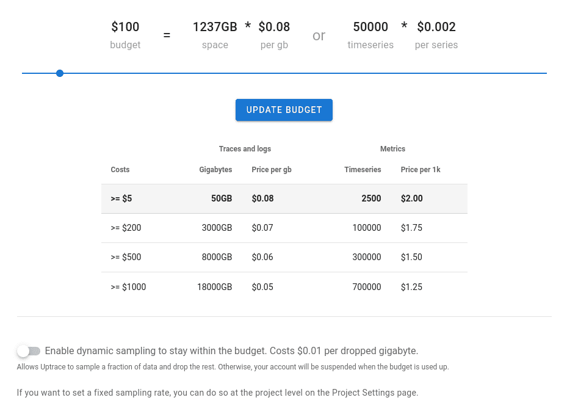
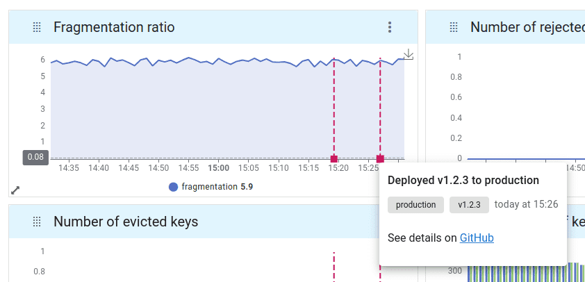
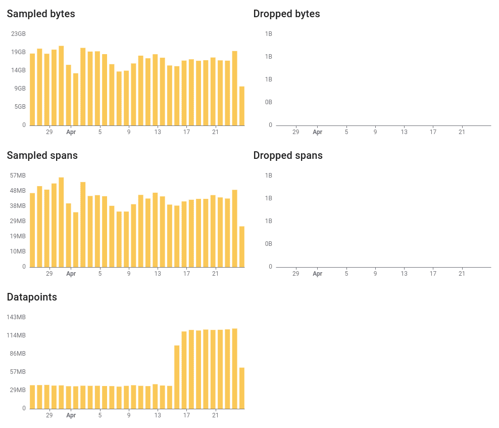
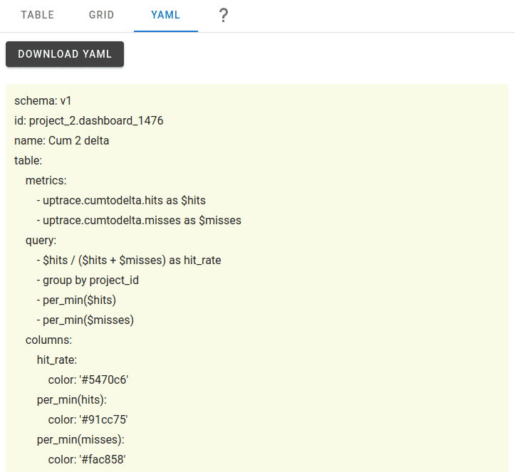
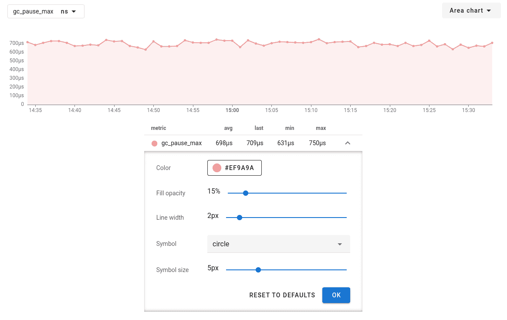
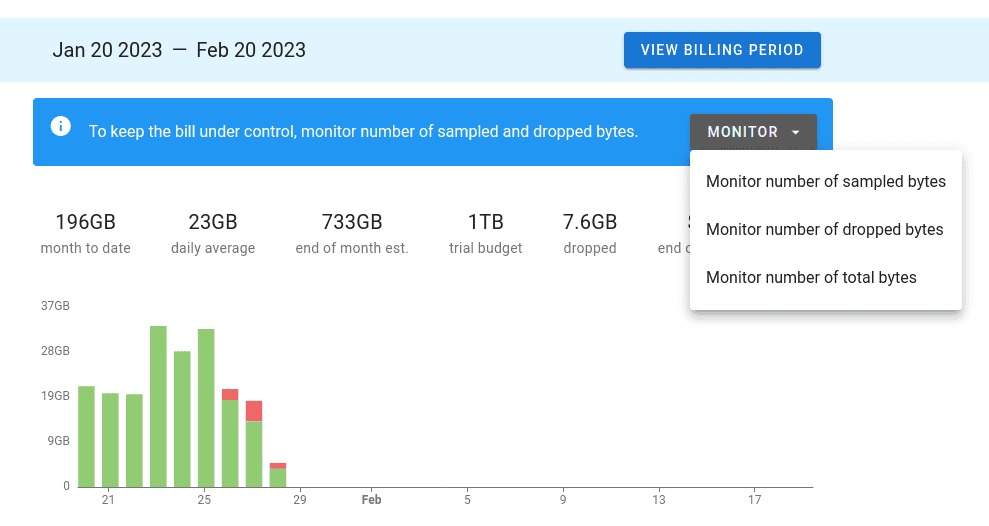
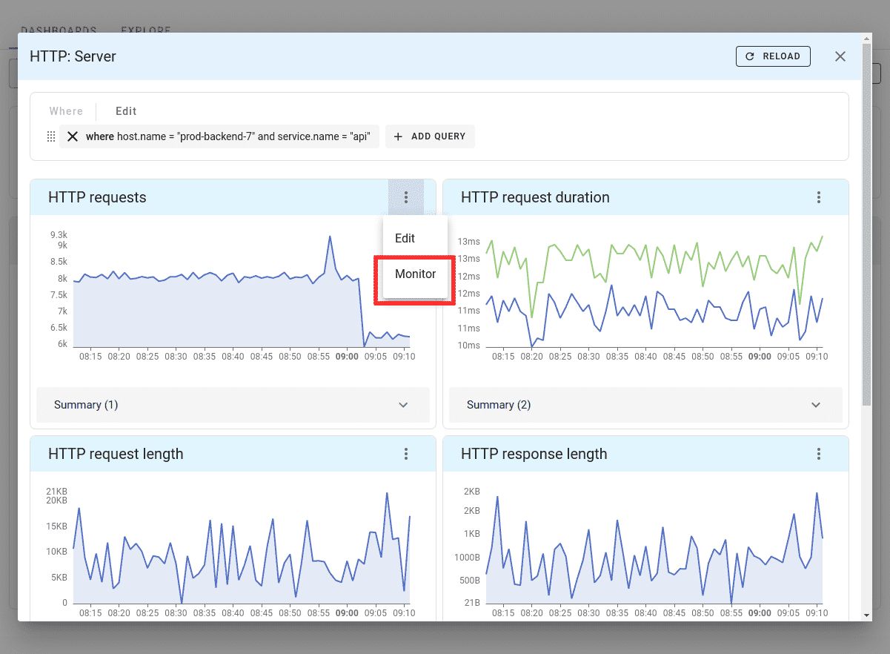
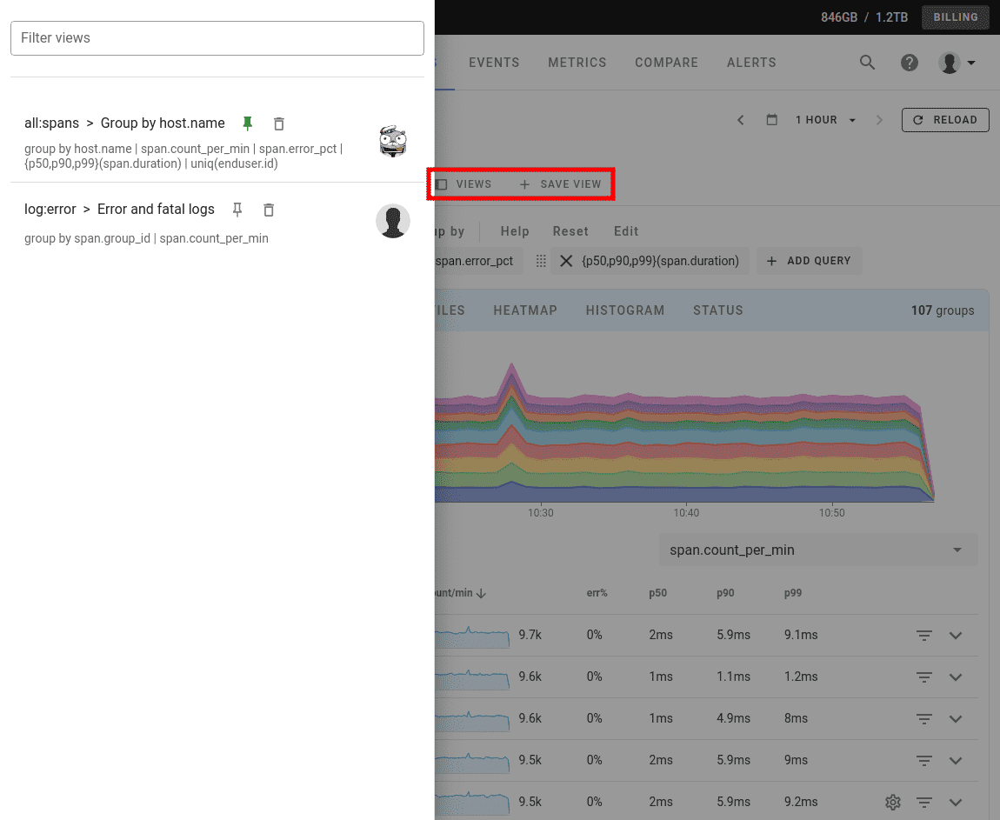

## September 29 2023

- On the billing page, allow to set per-project budget and enable/disable dynamically adjusted
  sampling.


- Implemented threading/grouping for email notifications.

- Migrated to the
  [v1.21](https://github.com/open-telemetry/opentelemetry-specification/blob/main/schemas/1.21.0)
  OpenTelemetry schema which introduced some breaking changes to attribute names.

  Most notably:

  - `http.method` is renamed to `http.request.method`.
  - `http.status_code` is renamed to `http.response.status_code`.
  - `http.client_ip` is renamed to `client.address`.

  Uptrace should automatically handle both variants, but you may need to update your favorite
  queries.

## September 12 2023

- Added `uptrace.billing.spans` metric with the number of sampled and dropped spans/logs.


- The number of dropped bytes metric is removed, because it is not always possible to accurately
  track this metric. The number of sampled bytes is still maintained.

- Added support for dynamically adjusted sampling to stay within the budget. When enabled, sampling
  is adjusted every 5 minutes.



## August 1 2023

Added more user roles:

- **Outside Collaborator**. Can be added to a team to access team projects.
- **Member**. Can be added to a team to access team projects. Can create new projects.
- **Any Viewer**. Can view any project in the org. Can create new projects.
- **Any Admin**. Can admin any project in the org. Can create new projects.
- **Billing Manager**. Can manage billing details. Can create new projects.
- **Owner**. Has full administrative access to the entire organization.

Added more notification channels:

- Opsgenie
- Telegram


## July 25 2023

Added Single Sign-On support using OpenID Connect (OIDC) and SAML 2.0, for example,
[Google](https://uptrace.dev/get/sso/google.html), [Okta](https://uptrace.dev/get/sso/okta.html),
and [Keycloak](https://uptrace.dev/get/sso/keycloak.html).

Single Sign-On allows to manage users using OIDC or SAML providers. After logging in, such users are
automatically added to a team and can access team projects. When users are removed by the provider,
they automatically lose granted access.

## June 22 2023

Add support for [Chart annotations](https://uptrace.dev/get/annotations.html).



## June 17 2023

Add [Prometheus remote write](https://uptrace.dev/get/ingest/prometheus.html) support.

## June 10 2023

Improve spans querying language, for example, `per_min(sum(http.read_bytes)) as read_per_min` is now
supported.

## June 01 2023

Add [Vercel Logs](https://uptrace.dev/get/ingest/vercel.html) integration.

## May 21 2023

- Added Spans, Logs, and Events system groups.
- Uptrace now uses [display.name](https://uptrace.dev/get/grouping.html#display-name) instead of
  `.name` and `.event_name` attributes.
- You can now use `display.name contains "get|post"` to search for spans, logs, and events at the
  same time.
- Exceptions are now grouped together with `log.error` logs. You can still distinguish logs and
  exceptions using `where exception.type exists` filter.

  

## May 10 2023

- Span attributes now start with a dot, for example, `.name` instead of `span.name`. In metrics,
  this can lead to names like `$spans..name` and `$spans..status_code`.

## Apr 25 2023

- Add a separate page to each organization that displays number or ingested bytes, spans, and
  datapoints.

  On that page you can also change **Paddle subscription** that is used to process payments.

  To view org billing info, click Organizations -> Org Name -> Billing and usage.

  

## Apr 19 2023

- Add [AWS CloudWatch intergration](https://uptrace.dev/get/ingest/aws-cloudwatch.html) to collect
  metrics and logs from AWS CloudWatch.

- Add [FluentBit integration](https://uptrace.dev/get/ingest/fluent-bit.html) to ingest logs into
  Uptrace.

## Apr 16 2023

- Histogram metric changed from `per_min($metric_name)` to `per_min(count($metric_name))` for
  clarity. Existing dashboards should be automatically updated.

  You can now also use `per_min` as a general function, for example, `per_min(p50($metric_name))`
  which is the equivalent of `p50($metric_name) / _minutes`.

- Documented [Uptrace Enterprise](https://uptrace.dev/get/enterprise.html) features.

## Apr 5 2023

- Accept errors and spans from [Sentry SDK](https://uptrace.dev/get/ingest/sentry.html). The
  integration was created so you can use
  [Sentry for browsers](https://uptrace.dev/get/ingest/sentry.html#sentry-for-browsers) with
  Uptrace.

## March 20 2023

- Added metrics [pricing](https://uptrace.dev/pricing).

> > The cost of metrics is **$2 for 1000 timeseries**. Uptrace stores 1 datapoint per minute for
> > each timeseries and uses the number of active datapoints to calculate the bill.

> > Also, for every $5 spent on tracing or logs, you get 1000 timeseries for free. For example, if
> > your tracing bill is $100, you get 20k timeseries for free.

> > A timeseries is a metric with an unique set of attributes/labels. For example, if you collect 10
> > metrics on each host and you have 10 hosts, that is 10\*10=100 timeseries.

> > A datapoint is a single measured occurrence of a metric within a timeseries, consisting of a
> > value and timestamp.

## March 18 2023

- Added AlertManager notification channel.

  

## March 15 2023

- Allow to customize chart legends. Table and list-based legends are supported.

  

## March 9 2023

- Allow to [edit dashboards](https://app.uptrace.dev/metrics/1/7?tab=yaml) using YAML format.

  

## March 6 2023

- Allow to customize colors and some chart styles.

  

  

## March 5 2023

- Allow to to name DSN to simplify managing multiple DSNs.

  

## Feb 24 2023

- Metrics dashboards now support 2 new visualizations types: **tables** and **heatmaps**.

  

## Feb 16 2023

- Added new notification channel: **webhooks**. Webhooks allow receiving notifications about alerts
  managed by Uptrace via HTTP POST requests.

  

  For example, you will receive the following JSON message when an alert is created:

  ```json
  {
    "id": "1676471814931265794",
    "eventName": "created",
    "payload": { "custom_key": "custom_value" },
    "createdAt": "2023-02-15T14:36:54.931265914Z",

    "alert": {
      "id": "123",
      "url": "https://app.uptrace.dev/alerting/1/alerts/123",
      "name": "Test message",
      "type": "metric",
      "state": "open",
      "createdAt": "2023-02-15T14:36:54.931265914Z"
    }
  }
  ```

## Feb 15 2023

- Allow to create "Text gauges" at the top of dashboards.

- Allow to quickly change grouping in the Table dashboards. Pinned attributes are displayed first.

  

## Feb 10 2023

- Improved `uptrace.tracing.spans` and `uptrace.tracing.events` to fetch data directly from the
  spans table. That means that you can now group and filter by all available span attributes.

- Improved metrics UI to provide attribute facets just like with spans.

  

## Feb 08 2023

- Added a view to visualize spans query results as a chart. You can save the resulting view using
  "Saved views" feature.

  

## Feb 01 2023

- Added an ability to create errors monitors in addition to metrics monitors. Using errors monitors,
  you can include/exclude certain errors by span attributes, for example, to receive notifications
  only for certain environments or services.

  

## Jan 27 2023

- You can now configure per-project sampling to sample a fraction of spans and drop the rest.

  You can also adjust sampling fraction depending on span attributes, for example, you can have
  different sampling fraction depending on `deployment.environment` attribute.

  Visit the [Billing](https://app.uptrace.dev/billing) page to learn more.

- You can now monitor number of sampled and dropped bytes to get notified when you receive more data
  than usually.

  

## Jan 2 2023

- To ease navigation, all alerting-related pages are grouped under the "Alerts" tab.

- You can now configure multiple Slack and PagerDuty notification channels. Channels are associated
  with projects, not users.

- You can specify notification channels immediately when creating metrics monitors.

- Span groups are no longer automatically monitored. Instead, Uptrace converts spans to metrics and
  you can monitor spans metrics using monitors.

  By default, the following metrics are available: `uptrace.tracing.spans`,
  `uptrace.tracing.events`, `uptrace.billing.bytes`. In future, you will be able to create custom
  metrics from spans.

  Using `uptrace.tracing.spans` metric, you can monitor number of spans, errors, error rate, and
  p50/p75/p90/p99 duration.

- You can quickly create metrics monitors from span systems:

  

  From services and hostnames:

  

  And metrics:

  

## Dec 27 2022

- Improve logs and errors grouping.

## Dec 16 2022

- Allow to filter span facets by attribute key.

## Dec 15 2022

- Added ability to save and restore views:



## Dec 05 2022

- Added ability to pin attributes/facets to the top:


## Nov 25 2022

- Added ability to retry payments on the billing page.
- You can now change payment details in Paddle without recreating a subscription.

## Nov 15 2022

[Pricing](https://uptrace.dev/pricing/) is updated with the following changes:

- Added more volume-based discounts.

- Removed minimum **$30** payment. If your monthly usage is 70 gigabytes, you will be billed $7
  instead of $30.

- Uptrace now bills for the amount of ingested gigabytes monthly or **every $100**, whichever
  happens first. All payments with receipts are available on your billing page.

- Tail-based sampling is now billed separately at **$0.02** per gigabyte.

- You can disable tail-based sampling to get a discount, but Uptrace will stop processing new spans
  when your monthly budget is fully spent. In that case, you need to increase the budget or wait
  until the next billing cycle.

  When tail-based sampling is enabled, Uptrace makes sure your budget is spent uniformly across the
  month so you always have fresh statistics.

  Tail-based sampling is disabled by default.

- Starting from December 1st, users on the free tier won't be able to use tail-based sampling.

## Nov 1 2022

- Added quick filters by `deployment.environment` and `service.name` attributes.

- Added faceted filters for spans and events.

- Added a project setting to group spans by `deployment.environment` attribute.

- Added a project setting to group spans with `funcs` system by `service.name` attribute.


## Oct 20 2022

- Released an initial version of [uptrace-php](https://github.com/uptrace/uptrace-php)
