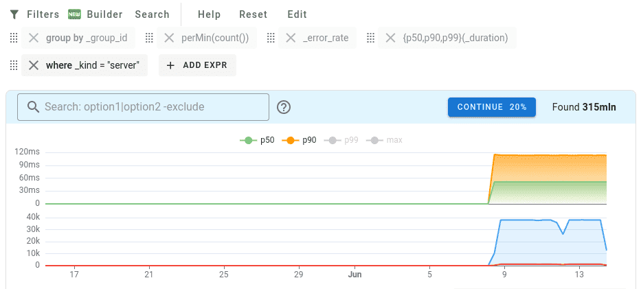
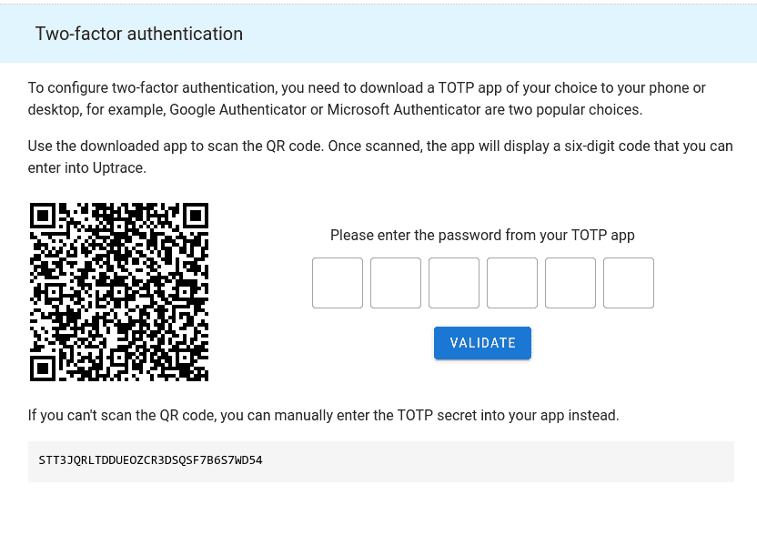
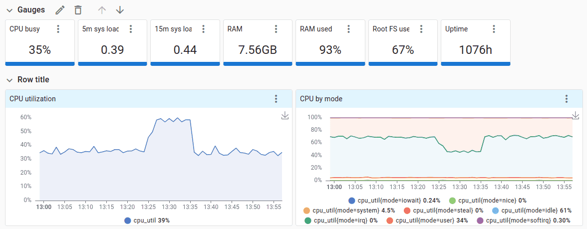
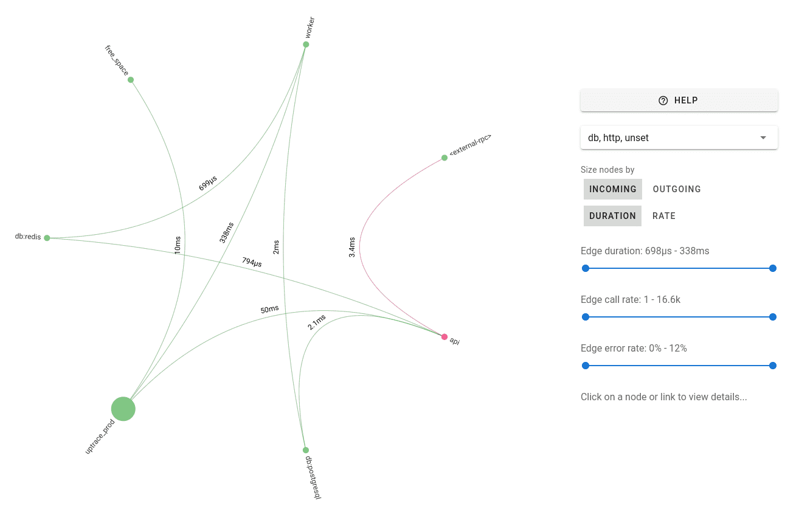
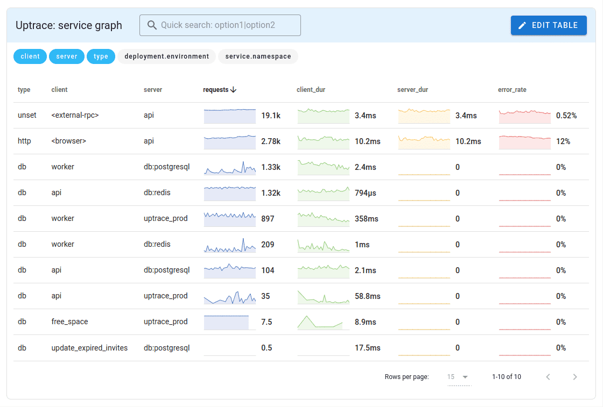
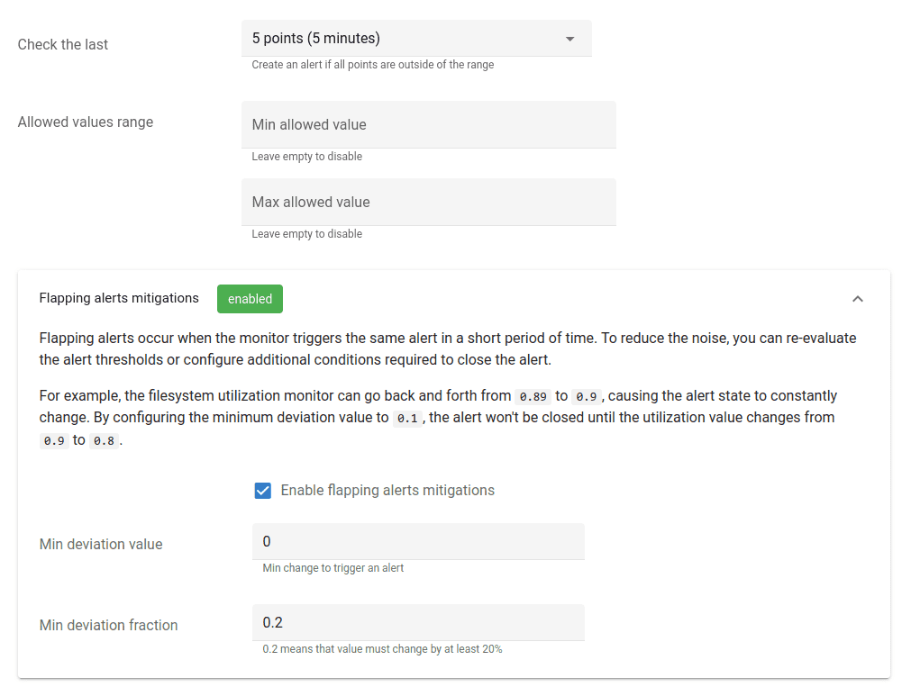
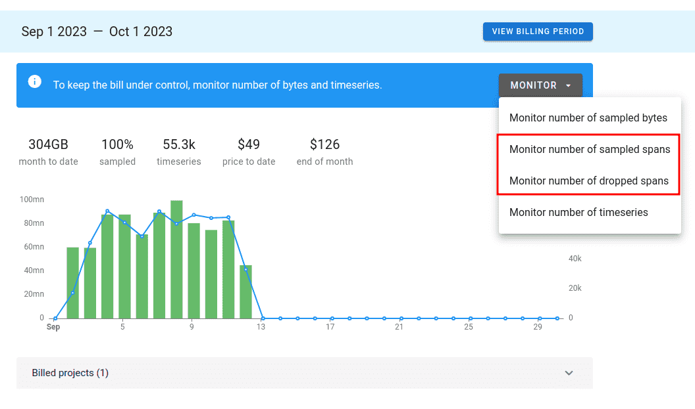
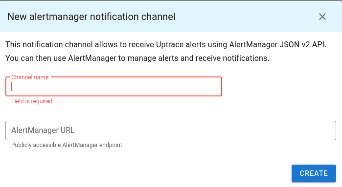
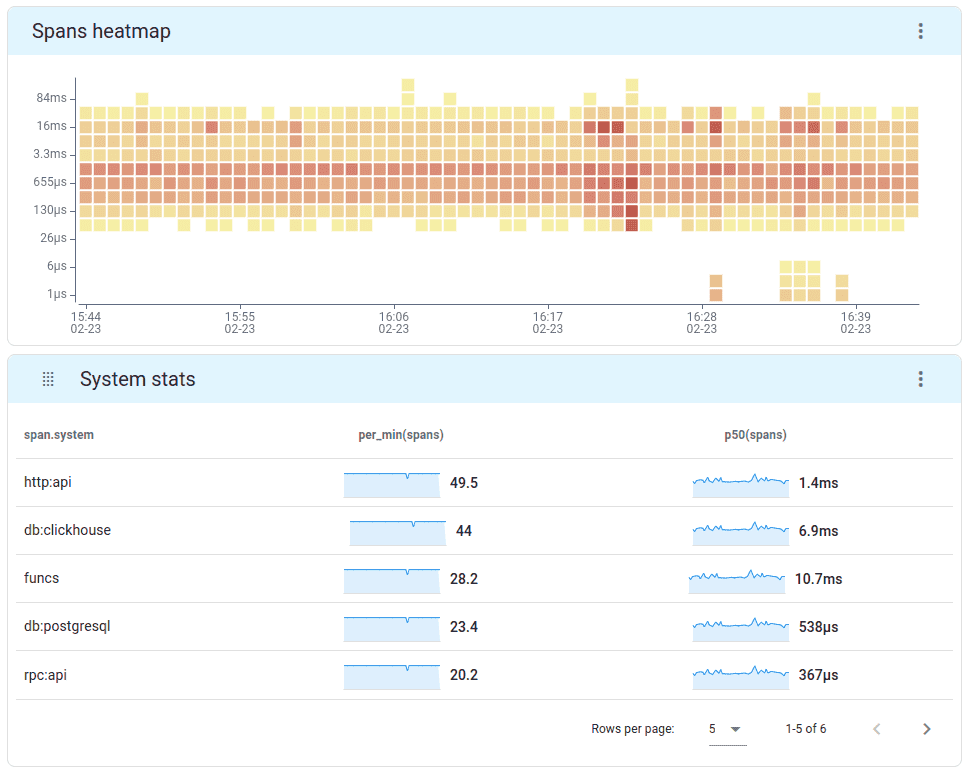
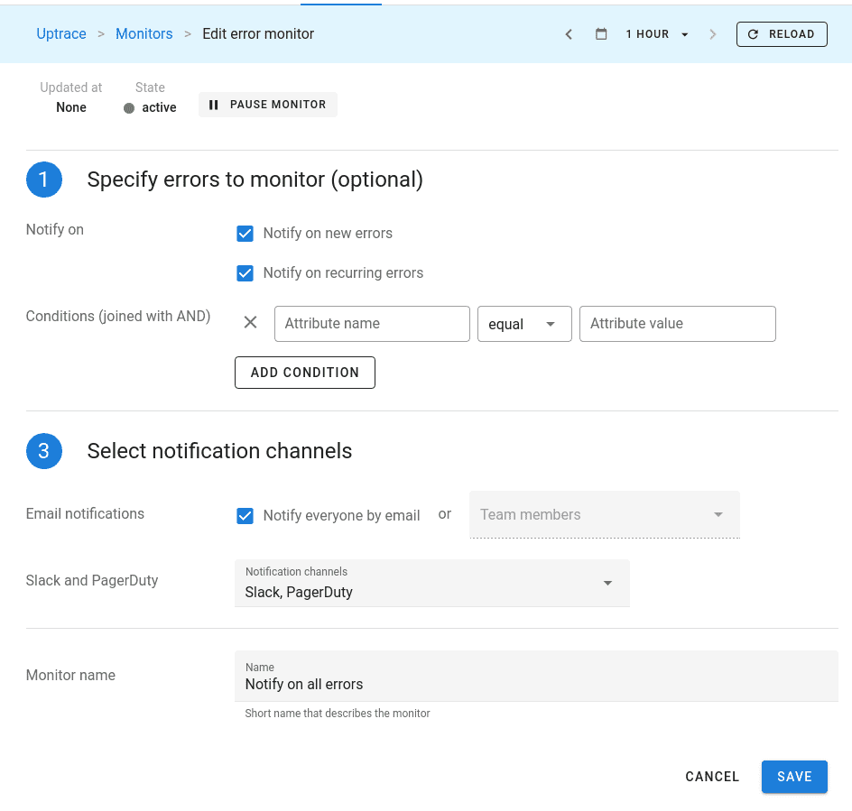

## August 12 2024

You can now transform ingested data directly in Uptrace without using OpenTelemetry Collector. The following operations are supported:

- `rename_attr` allows to change the attribute name.
- `delete_attrs` allows to delete attributes by their exact name or by a regular expression.
- `keep_attrs` allows to keep some attributes and delete the rest.
- `drop` allows to drop matching spans/events/logs/datapoints.
- `sample` allows to sample a fraction of spans/events/logs.
- `script` enables writing simple scripts to parse attributes, reduce attributes cardinality, turn logs into spans, etc.

See [documentation](https://uptrace.dev/get/transformations.html) for details.

## July 29 2024

When [searching spans and logs](https://uptrace.dev/get/searching-spans.html), a word filter now matches full words/tokens. If you want to search for logs that contain a certain prefix, just add \* to the end of the word.

For example, the query `err*` will find the following logs:

```
err
error
an_error
```

You can also search over all attribute values using `_attrs` scope:

```
_attrs:error
```

See [documentation](https://uptrace.dev/get/searching-spans.html) for more details.

## June 14 2024

Uptrace now supports incremental query mode when searching or filtering spans/logs, which allows to search over large periods of time.

It works like this:

- Incremental mode is enabled when searching or filtering, i.e. it does not work without search or filters.

- Uptrace incrementally searches spans/logs hour by hour and sends you search results every 5 seconds.

- The incremental search will stop after 20 seconds, but you can continue searching by pressing the "Continue" button.

- Search results are stored in a special table and are deleted after 10 days. If you try the same search on another day, it will continue from the last saved point.

For now, this optimization does not work when searching over groups and loading filter facets. It will be added later this month.



## May 28 2024

Both tracing and metrics now support more complex WHERE such as `(service_name = "s1" AND log_severity = "DEBUG") OR (service_name = "s2" AND log_severity = "INFO")`.

Tracing now allows you to use [If](https://clickhouse.com/docs/en/sql-reference/aggregate-functions/combinators#-if) combinator from ClickHouse, for example, `countIf(_status_code = "error")` or `sumIf(_count, service_name = "s1")`. With metrics, you can achieve the same with `count($spans{_status_code="error"})`.

Filters now behave differently when the attribute does not exist, for example, `where attr1 = ""` excludes spans that don't have the attribute. You can get the old behavior by using `where attr1 = "" or attr1 does not exist`.

## May 20 2024

- You can now tag saved view to organize them into categories.

- Alert filters are reworked after tracing and metrics filters. You can now pin/unpin attributes.

- Uptrace now supports all OpenTelemetry [severity levels](https://opentelemetry.io/docs/specs/otel/logs/data-model/#displaying-severity) such as `TRACE1`, `TRACE2`, `TRACE3`, etc. System names remain unchanged, for example, `log:trace`, `log:info`, `log:warn`, etc.

## May 13 2024

Error monitors have been reworked:

- You can use all available filters to include/exclude monitored errors. You can also customize default filters to monitor `WARN` logs.

- You can add `group by` clauses to customize the default errors grouping and create a separate alert/notification, for example, `group by _group_id, service_name, cloud_region`.

- Uptrace no longer creates alerts for excluded errors.

- Notifications frequency no longer depends on the error count and instead notifies you every 1/6/24+ hours.

Existing error monitors should be converted automatically. No action is required.

Existing alerts are removed, so you should see an increase in error notifications for a few days.

## May 6 2024

The quick search now allows to specify the search attribute:

- `_kind:client`. Include items with "\_kind" containing "client".
- `-key:value`. Exclude items with "key" containing "value".
- `~msg:regexp`. Include items with "msg" matching the "regexp".

Besides, the `_count` is no longer an alias for `sum(_count)`, but instead points to the column holding the adjusted count. Now you should use `sum(_count)` and `per_min(sum(_count))` to count the number of items.

`_error_rate` is still supported and is an alias for `sum(_error_count) / sum(_count)`.

## Apr 22 2024

- `log_message` and `exception_message` attributes are automatically promoted to `display_name` when used in logs. The original attribute is removed to avoid double indexing.

  Instead of `log_message contains "something"` you should use `display_name contains "something"`. The default search will continue to work as previously.

- Removed `_kind` and `_status_code` attributes from the logs and events, because the OpenTelemetry data model does not support such attributes. Previously, these attributes were inherited from spans when possible.

## April 14 2024

Added support for two-factor authentication (2FA) using a one-time password.

- You can enable 2FA on your profile page.
- On the org page, admins can require 2FA for all org users. Users without 2FA won't be able to access org data until they configure 2FA.



## April 9 2024

- Both traces and metrics now support the following functions: `extract(haystack, pattern)`, `replace(haystack, substring, replacement)`, and `replace_regexp(haystack, pattern, replacement)`.

  These functions are most useful in grouping expressions, for example:

  ```
  group by extract(host_name, `^uptrace-prod-(\w+)$`) as host
  group by replace_regexp(host_name, `^some-prefix-(\w+)$`, `\1`) as host
  ```

  See [documentation](https://uptrace.dev/get/querying-metrics.html#manipulating-attributes) for details.

- You can use dot notation to access sub-fields in nested structures such as JSON, for example, `data.key1.subkey1` can extract the field value from the following JSON:

  ```json
  {
    "data": {
      "key1": {
        "subkey1": "value1"
      }
    }
  }
  ```

  This does not work for arrays.

## March 23 2024

- Added support for dark mode. Dark mode should be enabled automatically if your operating system uses a dark theme. It can also be enabled manually using the switch in the upper right corner.

- The `http` system is split into `httpclient` and `httpserver` depending on the span kind. You can learn more about systems [here](https://uptrace.dev/get/grouping.html#span-systems).

  If the feedback is positive, we're going to do the same for the `rpc` system.

- You can now increase data retention on the Project Settings page for an additional fee.

- Single sign-on now allows you to specify a regexp to validate user emails, for example, you can only allow users with a certain domain.

- Navigation is reworked using a navigation drawer.

## January 22 2024

Uptrace is now mostly compatible with the Prometheus query language, for example, the following PromQL expressions are also valid in Uptrace:

- `$metric_name{foo="xxx",bar~"yyy"}`
- `increase($metric_name)` and `delta($metric_name)`
- `rate($metric_name[5m])` and `irate($metric_name[5m])`
- `avg_over_time($go_goroutines[5m])`
- `avg by (foo)(sum by(foo, bar)($metric_name))`
- `$metric_name offset 1w`
- Math between series with automatic many-to-one/one-to-many vector matching, for example, `sum($mem by (type)) / sum($mem) as mem`.

See [documentation](https://uptrace.dev/get/promql-compat.html) for more details.

## January 2 2024

- Improved metrics UI. Added ability to group items into rows.

  

- Added ability to use Uptrace as a [Prometheus data source in Grafana](https://uptrace.dev/get/grafana.html). Uptrace uses the original Prometheus engine so all Prometheus queries should be supported and you should be able to use existing Grafana dashboards with the Uptrace data source.

- Added ability to customize grouping when querying metrics, for example, `sum(irate($cpu_secs by (mode, cpu)) by (mode)) / sum(irate($cpu_secs by (mode, cpu)))`.

- Metric names and attributes are automatically changed to comply with Prometheus/Loki restrictions, for example, `service.name` becomes `service_name`.

- Added ability to view/create monitors from YAML.

- Added Mattermost notification channel.

## November 3 2023

- Added support for service graphs.

  Service Graphs provide a visual representation of service interactions, dependencies, and performance metrics. Service graphs are built by analyzing span relationships and require specific span attributes.

  

  The same data is also available as a metrics dashboard:

  

- Added Microsoft Teams notification channel.

## October 10 2023

- You can now create custom [grouping rules](https://uptrace.dev/get/grouping-rules.html) for logs and exceptions.

  For example, you can configure Uptrace to create a separate error group for each unknown PostgreSQL column:

  ```
  # Error messages
  ERROR: column "event.created_at" does not exist (SQLSTATE=42703)
  ERROR: column "updated_at" does not exist (SQLSTATE=42703)
  ERROR: column "name" does not exist (SQLSTATE=42703)

  # Pattern
  log.severity=ERROR column column_name=<quoted,fingerprint> does not exist sqlstate=<kv>
  ```

- Added ability to specify aliases in the `group by` clause, for example, `group by host.name as host`. This allows to join metrics with different attributes:

  ```
  $metric1 + $metric2 | group by $metric1.host.name | group by $metric2.host as host.name
  ```

- Added flapping alerts mitigations to metrics monitors.

  

- Migrated some metric attributes to the [v1.21](https://github.com/open-telemetry/opentelemetry-specification/blob/main/schemas/1.21.0) OpenTelemetry schema which introduced some breaking changes to attribute names.

  Most notably:

  - `http.method` is renamed to `http.request.method`.
  - `http.status_code` is renamed to `http.response.status_code`.

## September 29 2023

- On the billing page, allow to set per-project budget and enable/disable dynamically adjusted sampling.


- Implemented threading/grouping for email notifications.

- Migrated to the [v1.21](https://github.com/open-telemetry/opentelemetry-specification/blob/main/schemas/1.21.0) OpenTelemetry schema which introduced some breaking changes to attribute names.

  Most notably:

  - `http.method` is renamed to `http.request.method`.
  - `http.status_code` is renamed to `http.response.status_code`.
  - `http.client_ip` is renamed to `client.address`.

  Uptrace should automatically handle both variants, but you may need to update your favorite queries.

## September 12 2023

- Added `uptrace.billing.spans` metric with the number of sampled and dropped spans/logs.



- The number of dropped bytes metric is removed, because it is not always possible to accurately track this metric. The number of sampled bytes is still maintained.

- Added support for dynamically adjusted sampling to stay within the budget. When enabled, sampling is adjusted every 5 minutes.


## August 1 2023

Added more user roles:

- **Outside Collaborator**. Can be added to a team to access team projects.
- **Member**. Can be added to a team to access team projects. Can create new projects.
- **Any Viewer**. Can view any project in the org. Can create new projects.
- **Any Admin**. Can admin any project in the org. Can create new projects.
- **Billing Manager**. Can manage billing details. Can create new projects.
- **Owner**. Has full administrative access to the entire organization.

Added more notification channels:

- Opsgenie
- Telegram


## July 25 2023

Added Single Sign-On support using OpenID Connect (OIDC) and SAML 2.0, for example, [Google](https://uptrace.dev/get/sso/google.html), [Okta](https://uptrace.dev/get/sso/okta.html), and [Keycloak](https://uptrace.dev/get/sso/keycloak.html).

Single Sign-On allows to manage users using OIDC or SAML providers. After logging in, such users are automatically added to a team and can access team projects. When users are removed by the provider, they automatically lose granted access.

## June 22 2023

Add support for [Chart annotations](https://uptrace.dev/get/annotations.html).


## June 17 2023

Add [Prometheus remote write](https://uptrace.dev/get/ingest/prometheus.html) support.

## June 10 2023

Improve spans querying language, for example, `per_min(sum(http.read_bytes)) as read_per_min` is now supported.

## June 01 2023

Add [Vercel Logs](https://uptrace.dev/get/ingest/vercel.html) integration.

## May 21 2023

- Added Spans, Logs, and Events system groups.
- Uptrace now uses [display.name](https://uptrace.dev/get/grouping.html#display-name) instead of `.name` and `.event_name` attributes.
- You can now use `display.name contains "get|post"` to search for spans, logs, and events at the same time.
- Exceptions are now grouped together with `log.error` logs. You can still distinguish logs and exceptions using `where exception.type exists` filter.

  

## May 10 2023

- Span attributes now start with a dot, for example, `.name` instead of `span.name`. In metrics, this can lead to names like `$spans..name` and `$spans..status_code`.

## Apr 25 2023

- Add a separate page to each organization that displays number or ingested bytes, spans, and datapoints.

  On that page you can also change **Paddle subscription** that is used to process payments.

  To view org billing info, click Organizations -> Org Name -> Billing and usage.

  

## Apr 19 2023

- Add [AWS CloudWatch intergration](https://uptrace.dev/get/ingest/aws-cloudwatch.html) to collect metrics and logs from AWS CloudWatch.

- Add [FluentBit integration](https://uptrace.dev/get/ingest/fluent-bit.html) to ingest logs into Uptrace.

## Apr 16 2023

- Histogram metric changed from `per_min($metric_name)` to `per_min(count($metric_name))` for clarity. Existing dashboards should be automatically updated.

  You can now also use `per_min` as a general function, for example, `per_min(p50($metric_name))` which is the equivalent of `p50($metric_name) / _minutes`.

- Documented [Uptrace Enterprise](https://uptrace.dev/get/enterprise.html) features.

## Apr 5 2023

- Accept errors and spans from [Sentry SDK](https://uptrace.dev/get/ingest/sentry.html). The integration was created so you can use [Sentry for browsers](https://uptrace.dev/get/ingest/sentry.html#sentry-for-browsers) with Uptrace.

## March 20 2023

- Added metrics [pricing](https://uptrace.dev/pricing).

> > The cost of metrics is **$2 for 1000 timeseries**. Uptrace stores 1 datapoint per minute for each timeseries and uses the number of active datapoints to calculate the bill.

> > Also, for every $5 spent on tracing or logs, you get 1000 timeseries for free. For example, if your tracing bill is $100, you get 20k timeseries for free.

> > A timeseries is a metric with an unique set of attributes/labels. For example, if you collect 10 metrics on each host and you have 10 hosts, that is 10\*10=100 timeseries.

> > A datapoint is a single measured occurrence of a metric within a timeseries, consisting of a value and timestamp.

## March 18 2023

- Added AlertManager notification channel.

  

## March 15 2023

- Allow to customize chart legends. Table and list-based legends are supported.

  

## March 9 2023

- Allow to [edit dashboards](https://app.uptrace.dev/metrics/1/7?tab=yaml) using YAML format.

  

## March 6 2023

- Allow to customize colors and some chart styles.

  

  

## March 5 2023

- Allow to to name DSN to simplify managing multiple DSNs.

  

## Feb 24 2023

- Metrics dashboards now support 2 new visualizations types: **tables** and **heatmaps**.

  

## Feb 16 2023

- Added new notification channel: **webhooks**. Webhooks allow receiving notifications about alerts managed by Uptrace via HTTP POST requests.

  

  For example, you will receive the following JSON message when an alert is created:

  ```json
  {
    "id": "1676471814931265794",
    "eventName": "created",
    "payload": { "custom_key": "custom_value" },
    "createdAt": "2023-02-15T14:36:54.931265914Z",

    "alert": {
      "id": "123",
      "url": "https://app.uptrace.dev/alerting/1/alerts/123",
      "name": "Test message",
      "type": "metric",
      "state": "open",
      "createdAt": "2023-02-15T14:36:54.931265914Z"
    }
  }
  ```

## Feb 15 2023

- Allow to create "Text gauges" at the top of dashboards.

- Allow to quickly change grouping in the Table dashboards. Pinned attributes are displayed first.

  

## Feb 10 2023

- Improved `uptrace.tracing.spans` and `uptrace.tracing.events` to fetch data directly from the spans table. That means that you can now group and filter by all available span attributes.

- Improved metrics UI to provide attribute facets just like with spans.

  

## Feb 08 2023

- Added a view to visualize spans query results as a chart. You can save the resulting view using "Saved views" feature.

  

## Feb 01 2023

- Added an ability to create errors monitors in addition to metrics monitors. Using errors monitors, you can include/exclude certain errors by span attributes, for example, to receive notifications only for certain environments or services.

  

## Jan 27 2023

- You can now configure per-project sampling to sample a fraction of spans and drop the rest.

  You can also adjust sampling fraction depending on span attributes, for example, you can have different sampling fraction depending on `deployment.environment` attribute.

  Visit the [Billing](https://app.uptrace.dev/billing) page to learn more.

- You can now monitor number of sampled and dropped bytes to get notified when you receive more data than usually.

  

## Jan 2 2023

- To ease navigation, all alerting-related pages are grouped under the "Alerts" tab.

- You can now configure multiple Slack and PagerDuty notification channels. Channels are associated with projects, not users.

- You can specify notification channels immediately when creating metrics monitors.

- Span groups are no longer automatically monitored. Instead, Uptrace converts spans to metrics and you can monitor spans metrics using monitors.

  By default, the following metrics are available: `uptrace.tracing.spans`, `uptrace.tracing.events`, `uptrace.billing.bytes`. In future, you will be able to create custom metrics from spans.

  Using `uptrace.tracing.spans` metric, you can monitor number of spans, errors, error rate, and p50/p75/p90/p99 duration.

- You can quickly create metrics monitors from span systems:

  

  From services and hostnames:

  

  And metrics:

  

## Dec 27 2022

- Improve logs and errors grouping.

## Dec 16 2022

- Allow to filter span facets by attribute key.

## Dec 15 2022

- Added ability to save and restore views:


## Dec 05 2022

- Added ability to pin attributes/facets to the top:


## Nov 25 2022

- Added ability to retry payments on the billing page.
- You can now change payment details in Paddle without recreating a subscription.

## Nov 15 2022

[Pricing](https://uptrace.dev/pricing/) is updated with the following changes:

- Added more volume-based discounts.

- Removed minimum **$30** payment. If your monthly usage is 70 gigabytes, you will be billed $7 instead of $30.

- Uptrace now bills for the amount of ingested gigabytes monthly or **every $100**, whichever happens first. All payments with receipts are available on your billing page.

- Tail-based sampling is now billed separately at **$0.02** per gigabyte.

- You can disable tail-based sampling to get a discount, but Uptrace will stop processing new spans when your monthly budget is fully spent. In that case, you need to increase the budget or wait until the next billing cycle.

  When tail-based sampling is enabled, Uptrace makes sure your budget is spent uniformly across the month so you always have fresh statistics.

  Tail-based sampling is disabled by default.

- Starting from December 1st, users on the free tier won't be able to use tail-based sampling.

## Nov 1 2022

- Added quick filters by `deployment.environment` and `service.name` attributes.

- Added faceted filters for spans and events.

- Added a project setting to group spans by `deployment.environment` attribute.

- Added a project setting to group spans with `funcs` system by `service.name` attribute.


## Oct 20 2022

- Released an initial version of [uptrace-php](https://github.com/uptrace/uptrace-php)
